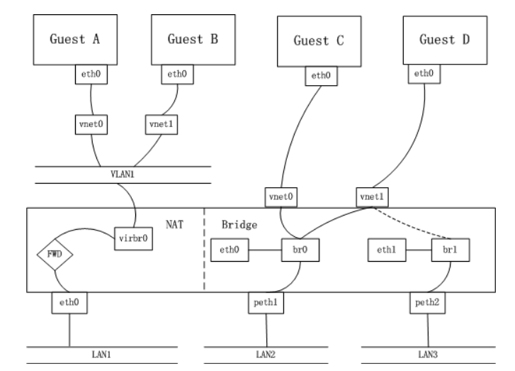
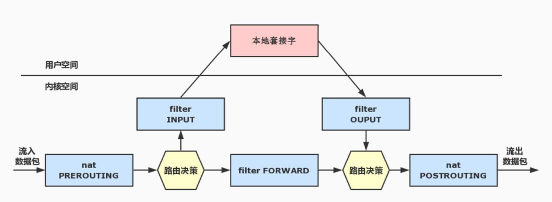

# IPTABLE, NAT, ROUTE

## 不同桥接框架图

不同桥接模式

## 相关信息前提

- HOSTIP: 172.20.101.236
- VMIP: 192.168.53.206

## HOOKS in linux kernel

内核中的5个hooks

## 报文在内核中的路径

- 报文流入本机: PREROUTING->INPUT->UserApp
- 报文流出本机: UserApp->OUTPUT->POSTROUTING
- 转发: PREROUTING->FORWARD->POSTROUTING

## DNAT/SNAT应用

- SNAT: 用于局域网访问互联网(数据包中源ip被修改)
- DNAT: 用于互联网访问局域网(数据包中目的ip被修改)

### SNAT配置

配置SNAT后在虚拟机能访问外网(将192.168.53.0/24网段发出的包原地址改成172.20.101.236)

	sudo iptables -t nat -A POSTROUTING -s 192.168.53.0/255.255.255.0 -j SNAT --to-source 172.20.101.236

或者使用MASQUERADE做动态SNAT

	sudo iptables -t nat -A POSTROUTING -s 192.168.53.0/255.255.255.0 -j MASQUERADE

### DNAT配置

将访问host:6022(6080)端口的数据修改为访问guest:22(80)端口

	sudo iptables -t nat -A PREROUTING -d 172.20.101.236 -p tcp -m tcp --dport 6022 -j DNAT --to-destination 192.168.53.206:22
	sudo iptables -t nat -A PREROUTING -d 172.20.101.236 -p tcp -m tcp --dport 6080 -j DNAT --to-destination 192.168.53.206:80

## 双网卡双NAT

HOST上有一张有线网卡eth0(br0)和一张无线网卡(wlan0)

- eth0(br0) 		172.20.101.101(gw 172.20.101.1)
- wlan0				172.20.238.101(gw 172.20.236.1)
- natbr0           	194.168.53.1/24
- natbr1           	193.168.53.1/24

### multipath route setting(多重路由,负载均衡设置)

	ip ro add default nexthop via 172.20.101.1 dev br0 weight 1 nexthop via 172.20.236.1 dev wlan0 weight 1

	$ ip ro sh
	default
			nexthop via 172.20.101.1  dev br0 weight 1
			nexthop via 172.20.236.1  dev wlan0 weight 1
	172.20.101.0/24 dev br0  proto kernel  scope link  src 172.20.101.101  metric 425
	172.20.236.0/22 dev wlan0  proto kernel  scope link  src 172.20.238.101  metric 600
	193.168.53.0/24 dev natbr1  proto kernel  scope link  src 193.168.53.1
	194.168.53.0/24 dev natbr0  proto kernel  scope link  src 194.168.53.1

### 防火墙设置(下面三种中任意一种即可)

第一种设置

	iptables -t nat -A POSTROUTING -s 194.168.53.0/24 -j SNAT --to-source 172.20.101.101
	iptables -t nat -A POSTROUTING -s 193.168.53.0/24 -j SNAT --to-source 172.20.238.101

第二种设置

	iptables -t nat -A POSTROUTING -s 194.168.53.0/24 -o br0 -j MASQUERADE
	iptables -t nat -A POSTROUTING -s 193.168.53.0/24 -o wlan0 -j MASQUERADE

第三种设置

	iptables -t nat -A POSTROUTING -s 193.168.53.174 -o wlan0 -j MASQUERADE
	iptables -t nat -A POSTROUTING -s 194.168.53.173 -o br0 -j MASQUERADE

### 调试过程中抓ICMP包

	tcpdump -nn icmp -i [ br0 | tap0 | wlan0 ]

### FAQ

对于虚拟机是linux系统,在host和guest中都反向过滤技术会是两块网卡无法同时使用

需要修改(改成0或2)相应的网卡的rp_filter配置

	echo 0 > /proc/sys/net/ipv4/conf/wlan0/rp_filter
